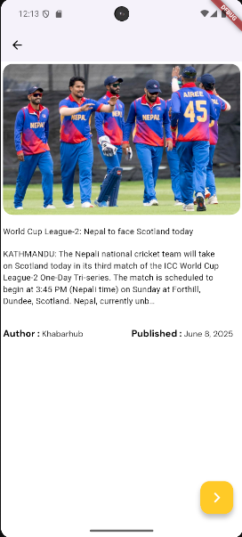

# 📰 Flutter News App

A sleek and modern News App built using Flutter, designed to fetch and display the latest news articles with a clean UI and smooth performance.

## 🚀 Features

- 🗞️ Browse latest news articles
- 🔍 Search news by topic or keyword
- 📄 Read full articles in-app
- 🌐 API integration for real-time content
- 💡 Light/Dark Theme Support
- 📱 Fully responsive across devices
- 🔄 Pagination & Lazy Loading
- 🧊 Shimmer Loading Effect (while fetching data)

## 📷 Screenshots

### 🏠 Home Screen  


### 📄 Article View  


### 🔍 Detail Screen  



## 🛠️ Tech Stack

- **Flutter** (Frontend)
- **Dart** (Language)
- **NewsAPI / any other** (API)
- **Provider / Bloc / Riverpod** (State Management) — _choose one you're using_
- **ScreenUtil / Responsive Framework** (for responsiveness)

## 📦 Installation

1. **Clone the repository**
   ```bash
   git clone https://github.com/your-username/flutter-news-app.git
   cd flutter-news-app
